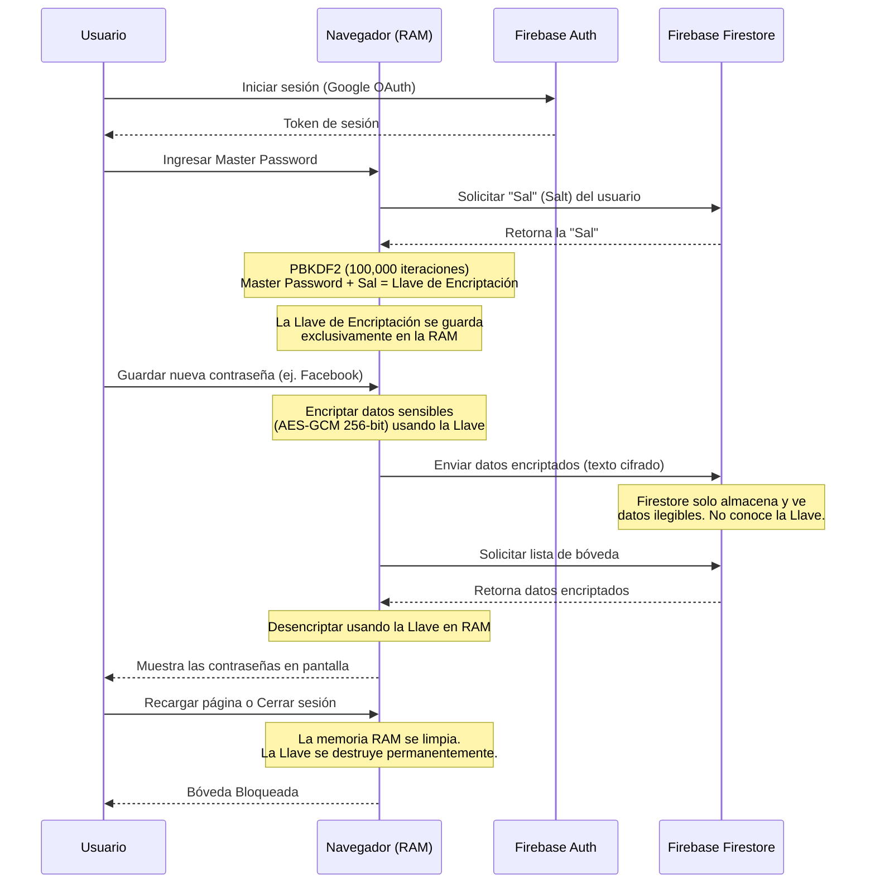

# 🔐 VaultOne

VaultOne es un gestor de contraseñas y bóveda digital personal ultra-seguro, construido con tecnologías web modernas. Su enfoque principal es la **privacidad absoluta** (Zero-Knowledge) y una **experiencia de usuario premium** con animaciones fluidas y diseño *glassmorphism* (cristal oscuro).

---

## ✨ Características Principales

- **🛡️ Cifrado de Extremo a Extremo (E2EE):** Tus datos se cifran en tu propio navegador usando el estándar AES-GCM (256-bit) antes de tocar el internet. Nadie, ni siquiera los administradores de la base de datos, pueden leer tus contraseñas.
- **🧠 Arquitectura Zero-Knowledge (Cero Conocimiento):** Tu Contraseña Maestra (Master Password) **nunca** se envía al servidor. Se utiliza localmente en tu dispositivo para derivar una llave criptográfica.
- **🔒 Seguridad en Memoria:** La llave de desencriptación vive únicamente en la memoria RAM de la pestaña. Si recargas la página, la memoria se borra y la bóveda se bloquea automáticamente para protegerte.
- **⚡ Rendimiento y Fluidez:** Construido como una Single Page Application (SPA), navegar entre el panel principal, tus contraseñas y configuraciones es instantáneo.
- **🎨 Diseño Premium:** Interfaz moderna y oscura con efectos de cristal, micro-animaciones en botones y respuestas visuales inmediatas.

---

## 🛠️ Stack Tecnológico

- **Frontend:** React 18, TypeScript, Vite.
- **Estilos y UI:** Tailwind CSS, Framer Motion (animaciones), Lucide React (íconos).
- **Estado y Enrutamiento:** Zustand (manejo de estado global), React Router v6, React Query (manejo de caché y asincronía).
- **Backend & Base de Datos:** Firebase Authentication (Inicio de sesión con Google) y Firebase Firestore (Base de datos NoSQL en tiempo real).
- **Criptografía:** Web Crypto API nativa del navegador.

---

## ⚙️ ¿Cómo funciona la seguridad bajo el capó?

1. **Autenticación (Firebase Auth):** Iniciamos sesión con nuestra cuenta de Google para obtener un ID de usuario único.
2. **Setup de Bóveda:** 
   - La primera vez que entras, configuras una "Master Password".
   - Tu navegador genera una "Sal" (Salt) aleatoria.
   - Usando tu Master Password + la Sal y aplicando el algoritmo PBKDF2 (con 100,000 iteraciones), se deriva una Llave de Encriptación súper fuerte.
   - La Sal se guarda en la base de datos (es información pública), pero la Llave y la Master Password se descartan.
3. **Desbloqueo:**
   - Cuando vuelves a entrar, ingresas tu Master Password.
   - El sistema descarga tu Sal, vuelve a realizar las 100,000 iteraciones matemáticas localmente y reconstruye tu Llave de Encriptación en la memoria RAM.
4. **Guardar datos:**
   - Al guardar una contraseña, VaultOne usa la llave en la RAM para cifrar todos los campos sensibles (contraseña, notas, usuario, web).
   - A Firestore solo se envía texto incomprensible (ej. `eyJhbGciOiJkaXIi...`).
5. **Leer datos:**
   - Al entrar al Dashboard, se descargan los textos cifrados.
   - Tu navegador, usando la llave en la RAM, descifra la información y la muestra en pantalla de forma instantánea.

---

## 📊 Arquitectura de Datos y Seguridad (Flujo)

El siguiente diagrama ilustra cómo fluye la información para garantizar que tus contraseñas nunca estén expuestas en texto plano fuera de tu dispositivo:

---
 
*Desarrollado con ❤️ combinando el poder de React y la seguridad criptográfica moderna.*

Anely0108
